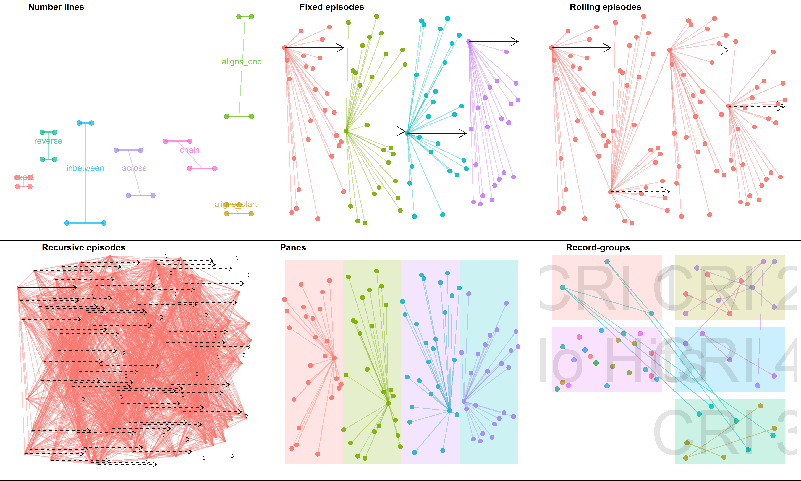

```{r setup, include = FALSE}
knitr::opts_chunk$set(
  collapse = TRUE,
  comment = "#>"
)
```

# diyar
[](https://cran.r-project.org/package=diyar)
[](https://www.r-pkg.org/pkg/diyar)
[](https://codecov.io/github/OlisaNsonwu/diyar?branch=master)
<!-- [](https://travis-ci.org/OlisaNsonwu/diyar) -->

## Overview
Record linkage and distinguishing between index, duplicate and recurrent events are common tasks in epidemiological analyses and other fields of research, particularly as part of a case definition. Implementing these in `R` can be complex and challenging. The `diyar` package provides a convenient and flexible way of doing these in `R`.

## Installation
```{r eval = FALSE}
# Install the latest CRAN release 
install.packages("diyar")

# Or, install the development version from GitHub
install.packages("devtools")
devtools::install_github("OlisaNsonwu/diyar")
```

## Usage



### Number line
Use `number_line()` to create `number_line` objects - a range of numeric values. These can be split or manipulated in several ways. 

```{r message = FALSE, warning = FALSE}
library(diyar)
nl <- number_line(1, 10); nl
invert_number_line(nl)
seq(nl, length.out = 3)
```

`overlap()` and related functions test how `number_line` objects overlap.
```{r message = FALSE, warning = FALSE}
overlap_method(nl, nl); reverse(nl, nl)
nl2 <- reverse_number_line(nl); nl2
overlap_method(nl, nl2); reverse(nl, nl2)
```  
Set operations such as `union_number_lines()` are also possible for pairs of `number_line` objects. 
```{r message = FALSE, warning = FALSE}
nl3 <- number_line(1, 20)
nl4 <- number_line(3, 6)
nl3; nl4
overlap_method(nl3, nl4)
intersect_number_lines(nl3, nl4)
subtract_number_lines(nl3, nl4)
```  
### Record linkage
Use `links()` to create a unique identifier for matching records based on a multistage deterministic approach to record linkage.
```{r message = FALSE, warning = FALSE}
attr_1 <- c(1, 1, 1, NA, NA, NA, NA, NA)
attr_2 <- c(NA, NA, 2, 2, 2, NA, NA, NA)
links(list(attr_1, attr_2))
```  
`links_wf_probabilistic()` is a wrapper function of `links()` to implement probabilistic record linkage.
```{r message = FALSE, warning = FALSE}
data(missing_staff_id)
dfr <- missing_staff_id[c("staff_id",  "initials", "hair_colour", "branch_office")]
links_wf_probabilistic(as.list(dfr), score_threshold = -4.2)
``` 

### Episode tracking
Use `episodes()` or `episodes_wf_splits()` to create a unique identifier for related events based on a case definition.
```{r message = FALSE, warning = FALSE}
episodes(1:7, case_length = 2)
episodes(1:7, case_length = 2, episode_type = "rolling")
``` 

Use `partitions()` to create a unique identifier for events within the same time or numerical interval.
```{r message = FALSE, warning = FALSE}
partitions(1:7, by = 2, separate = TRUE)
partitions(1:7, length.out = 3, separate = TRUE)
``` 

Find out more [here!](https://olisansonwu.github.io/diyar/index.html)

## Bugs and issues
Please report any bug or issues with using this package [here](https://github.com/OlisaNsonwu/diyar/issues).
