```{r setup, include = FALSE}
knitr::opts_chunk$set(
  collapse = TRUE,
  comment = "#>"
)
```

```{r include=FALSE}
library(diyar)
# library(cowplot)
library(ggplot2)
date <- function(x) as.Date(x, "%d/%m/%Y")
dttm <- function(x) as.POSIXct(x, "UTC", format = "%d/%m/%Y %H:%M:%S")
```

# Introduction
In epidemiological analyses an exact distinction between temporal events is not always possible. Thus, static but reasonable cut-offs are used to distinguish one case of an event from another. This is an important aspect of most case definitions. For example, distinguishing repeat or recurrent infections in a patient from their first occurrence.

Scripting such case definitions in `R` can be challenging. `episodes()` and `partitions()` provide a convenient but flexible solution to this. It links events into a temporal sequence, creating a unique group identifier with useful information about each group. These identifiers can then be used for record deduplication or further analyses.

# Overview
The group identifiers created by `episodes()` and `partitions()` are called episodes (`epid` class) and panes (`pane` class) respectively. `episodes()` creates three type of episodes - `"fixed"`, `"rolling"` and `"recursive"`. In `diyar`, a fixed episode is created by linking an index event to other events occuring within a specified period from of it. This results in a `"Case"` (index event) and related duplicate events (`"Duplicate_C"`). In a rolling episode, the process is repeated using another event from the existing episode as the reference event. This results in a `"Recurrent"` event and additional duplicate (`"Duplicate_R"`) events. Here, this repetition is referred to as a recurrence. Unless specified, recurrences will recur indefinitely until there are no more events within the period of recurrence. When this happens, the chain of recurrence ends and so does the episode. A recursive episode is similar to a rolling episode except that every event in the existing episode is used as a reference event. In contrast, a pane is created by separating events into set periods in time. The events in a pane have no relationship with each other, other than being in the same period or numeric interval. See the figure and example below.

```{r warning=FALSE}
# Events
event_dt <- seq(from = as.Date("2021-01-01"), to = as.Date("2021-01-11"), by = 1)
s_data <- data.frame(date = event_dt)
# Attribute 1 - Source of infection
attr_1 <- c("BSI", "UTI", "RTI", "RTI", "BSI", "BSI", "BSI", "RTI", "RTI", "BSI", "RTI")
# Attribute 2 - Location 
attr_2 <- c("Ward 1", "Ward 1", "Ward 3", "Ward 3", "Ward 2", "Ward 2", 
            "Ward 1", "Ward 1", "Ward 3","Ward 3", "Ward 2")
s_data$attr <- attr_1
# Fixed episodes
s_data$ep1 <- episodes(event_dt, case_length = 5, episode_type = "fixed")
# Rolling episodes
s_data$ep2 <- episodes(event_dt, case_length = 5, episode_type = "rolling",
                       group_stats = TRUE, data_source = attr_1)
# Recursive episodes
s_data$ep3 <- episodes(event_dt, case_length = 5, episode_type = "recursive")
# Panes
s_data$pn1 <- partitions(event_dt, length.out = 2, separate = TRUE)

# Identifiers
s_data
```

Each type of identifier has `as.data.frame` and `as.list` methods for easy access to their components.
```{r warning=FALSE}
# Components of an episode identifier
as.data.frame(s_data$ep2)
```

```{r warning=FALSE, include=FALSE}
# plt1 <- schema(s_data$ep1, seed = 2, show_label = c("length_label", "length_arrow"), theme = "light")
# plt2 <- schema(s_data$ep2, seed = 2, show_label = c("length_label", "length_arrow"), theme = "light")
# plt3 <- schema(s_data$ep3, seed = 2, show_label = c("length_label", "length_arrow"), theme = "light")
# plt4 <- schema(s_data$pn1, seed = 2, show_label = c("window_label"), theme = "light")
# f <- plot_grid(plt1 + theme(plot.background = element_rect(color = "black")),
#                plt2 + theme(plot.background = element_rect(color = "black")),
#                plt3 + theme(plot.background = element_rect(color = "black")),
#                plt4 + theme(plot.background = element_rect(color = "black")),
#                labels = c("Fixed episodes",
#                           "Rolling episodes",
#                           "Recursive episodes",
#                           "Panes"),
#                label_colour = "black",
#                label_size = 12,
#                label_x = c(-.065, -.065, -.0615, -.015))
# ggsave(plot = f, filename = "fig_e1.png", width = 15, height = 9, units = "in")
```

Figure 1 gives a visual representation of the difference between these identifiers.

**Figure 1: Episodes and panes** 

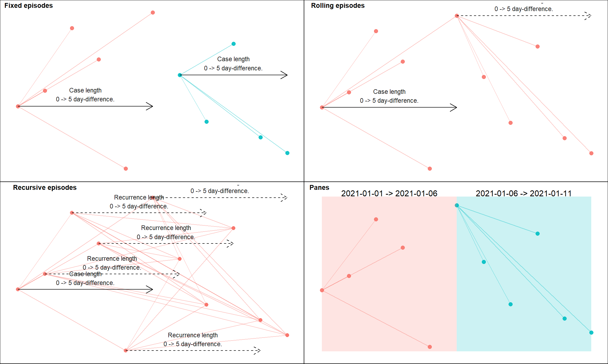

# Implementation
The main considerations in a case definition are accounted for in a flexible and modular way, so that most considerations can addressed independently or in a compounding manner. These considerations are summarised below.

## Criteria for an event's attribute
Additional matching criteria (separate from temporal links) can be implemented by the `strata`, `case_sub_criteria` and `recurrence_sub_criteria` arguments. `strata` introduces a blocking attribute which forces separate episodes and panes for different subsets of the dataset.

The figure and example below show how the `strata` argument is used.

```{r warning=FALSE}
# Matching clinical criteria
ep1 <- episodes(event_dt, strata = attr_1, case_length = 5)
# Matching geographical criteria
ep2 <- episodes(event_dt, strata = attr_2, case_length = 5)
```

```{r warning=FALSE, include=FALSE}
# plt1 <- schema(ep1, seed = 2,
#                show_label = "sn",
#                custom_label = attr_1, theme = "light")
# plt2 <- schema(ep2, seed = 2,
#                show_label = "sn",
#                custom_label = attr_2, theme = "light")
# 
# f <- plot_grid(plt1 + theme(plot.background = element_rect(color = "black")),
#                plt2 + theme(plot.background = element_rect(color = "black")),
#                labels = c("ep1", "ep2"),
#                label_colour = "black",
#                label_size = 12,
#                label_x = c(0, 0))
# ggsave(plot = f, filename = "fig_e2.png", width = 15, height = 4.5, units = "in")
```

**Figure 2: Using a `strata` to specify additional criteria for linked events**
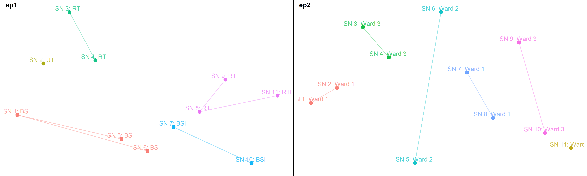

In contrast, the `case_sub_criteria` and `recurrence_sub_criteria` arguments apply a set of matching criteria to attributes associated with the events being compared. These arguments take a `sub_criteria` object. `sub_criteria` objects and how they are used are described in greater detail in `vignette("links")`. In summary, they contain a set of atomic vectors as attributes, a set of corresponding logical tests for each condition and another set of logical tests for the equivalence of values in an attribute. The evaluation of a `sub_criteria` is recursive and so allows for nested conditions.

The figure and example below show how the `case_sub_criteria` and `recurrence_sub_criteria` arguments are used.

```{r warning=FALSE}
# Attribute 3 - Patient sex
attr_3 <- c(rep("Female", 9), "Male", "Female")

# Sub-criteria 1 - Matching source of infection OR patient location
sub_cri_1 <- sub_criteria(attr_1, attr_2, operator = "or")
# Sub-criteria 2 - Matching source of infection AND patient location
sub_cri_2 <- sub_criteria(attr_1, attr_2, operator = "and")
# Sub-criteria 3 - (Matching source of infection AND patient location) OR (Matching patient sex)
sub_cri_3 <- sub_criteria(sub_cri_2, attr_3, operator = "or")
# Sub-criteria 4 - (Matching source of infection AND patient location) AND (Matching patient sex)
sub_cri_4 <- sub_criteria(sub_cri_2, attr_3, operator = "and")

ep3 <- episodes(event_dt, case_length = 5, case_sub_criteria = sub_cri_1)
ep4 <- episodes(event_dt, case_length = 5, case_sub_criteria = sub_cri_2)
ep5 <- episodes(event_dt, case_length = 5, case_sub_criteria = sub_cri_3)
ep6 <- episodes(event_dt, case_length = 5, case_sub_criteria = sub_cri_4)
```

```{r warning=FALSE, include=FALSE}
# plt1 <- schema(ep1, seed = 2,
#                show_label = FALSE,
#                custom_label = paste0(attr_1, " in ", attr_3, " at ", attr_2), theme = "light")
# plt2 <- schema(ep2, seed = 2,
#                show_label = FALSE,
#                custom_label = paste0(attr_1, " in ", attr_3, " at ", attr_2), theme = "light")
# plt3 <- schema(ep3, seed = 2,
#                show_label = FALSE,
#                custom_label = paste0(attr_1, " in ", attr_3, " at ", attr_2), theme = "light")
# plt4 <- schema(ep4, seed = 2,
#                show_label = FALSE,
#                custom_label = paste0(attr_1, " in ", attr_3, " at ", attr_2), theme = "light")
# 
# f <- plot_grid(plt1 + theme(plot.background = element_rect(color = "black")),
#                plt2 + theme(plot.background = element_rect(color = "black")),
#                plt3 + theme(plot.background = element_rect(color = "black")),
#                plt4 + theme(plot.background = element_rect(color = "black")),
#                labels = c("ep3", "ep4", "ep5", "ep6"),
#                label_colour = "black",
#                label_size = 12,
#                label_x = c(0, 0))
# ggsave(plot = f, filename = "fig_e3.png", width = 15, height = 9, units = "in")
```

**Figure 3: Using a `sub_criteria` to specify additional criteria for linked events**
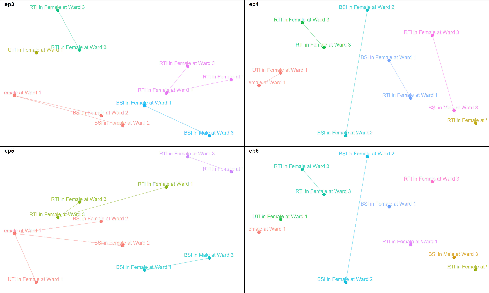

Using a `sub_criteria` incurs additional processing time therefore, it should be reserved for situations when a blocking attribute would not suffice or more complex matching criteria are required. The figure and example below show some examples of this.

```{r warning=FALSE}
# record id
rd_id <- 1:length(attr_1)

# Condition 1 - Each episode must include BSI events
cri_funx_1 <- function(x, y){
  splts <- split(x$attr, y$rd_id)
  splts_lgk <- lapply(splts, function(x){
    "RTI" %in% x
  })
  splts_lgk <- unlist(splts_lgk)
  splts_lgk[match(y$rd_id, names(splts))]
}

# Condition 2 - Each episode must include >=3 different sources of infection
cri_funx_2 <- function(x, y){
  splts <- split(x$attr, y$rd_id)
  splts_lgk <- lapply(splts, function(x){
    length(x[!duplicated(x)]) >= 3
  })
  splts_lgk <- unlist(splts_lgk)
  splts_lgk[match(y$rd_id, names(splts))]
}

# Equivalence - Logical test for matching attributes
eqv_funx <- function(x, y){
  x$rd_id == y$rd_id
}

# Sub-criteria 
sub_cri_5 <- sub_criteria(list(attr = attr_1, rd_id= rd_id), match_funcs = cri_funx_1, 
                          equal_funcs = eqv_funx)

sub_cri_6 <- sub_criteria(list(attr = attr_1, rd_id= rd_id), match_funcs = cri_funx_2,
                          equal_funcs = eqv_funx)

ep7 <- episodes(event_dt, case_length = 2, episode_type = "fixed", 
case_sub_criteria = sub_cri_5)

ep8 <- episodes(event_dt, case_length = 2, episode_type = "fixed",
                case_sub_criteria = sub_cri_6)
```

```{r warning=FALSE, include=FALSE}
# plt1 <- schema(ep7, seed = 2,
#                show_label = "sn",
#                custom_label = attr_1, theme = "light")
# plt2 <- schema(ep8, seed = 2,
#                show_label = "sn",
#                custom_label = attr_1, theme = "light")
# 
# f <- plot_grid(plt1 + theme(plot.background = element_rect(color = "black")),
#                plt2 + theme(plot.background = element_rect(color = "black")),
#                labels = c("ep7", "ep8"),
#                label_colour = "black",
#                label_size = 12,
#                label_x = c(0, 0))
# ggsave(plot = f, filename = "fig_e4.png", width = 15, height = 4.5, units = "in")
```

**Figure 4: Using `case_sub_criteria` to specify complex criteria for linked events**
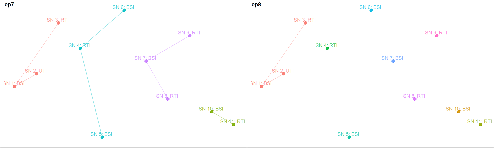

## Separating events into sections of time
This is best handled by `partitions()`. See the examples below.
```{r warning=FALSE}
# Group events into 2 equal parts over the strata's duration
pn2 <- partitions(event_dt, length.out = 2, separate = TRUE)

# Group events into 3-day sequences over the strata's duration
pn3 <- partitions(event_dt, by = 3, separate = TRUE)

# Group events into a specified period of time 
pn4 <- partitions(event_dt, window = number_line(event_dt[4], event_dt[7]))

# Group events from separate periods into one pane
pn5 <- partitions(event_dt, length.out = 2, separate = FALSE)
```

```{r warning=FALSE, include=FALSE}
# plt1 <- schema(pn2, seed = 2, show_label = c("window_label", "case_nm"), theme = "light")
# plt2 <- schema(pn3, seed = 2, show_label = c("window_label", "case_nm"), theme = "light")
# plt3 <- schema(pn4, seed = 2, show_label = c("window_label", "case_nm"), theme = "light")
# plt4 <- schema(pn5, seed = 2, show_label = c("window_label", "case_nm"), theme = "light")
# 
# f <- plot_grid(plt1 + theme(plot.background = element_rect(color = "black")),
#                plt2 + theme(plot.background = element_rect(color = "black")),
#                plt3 + theme(plot.background = element_rect(color = "black")),
#                plt4 + theme(plot.background = element_rect(color = "black")),
#                labels = c("pn2", "pn3", "pn4", "pn5"),
#                label_colour = "black",
#                label_y = c(0.07,.07,0.07,0.07))
# 
# ggsave(plot = f, filename = "fig_e5.png", width = 15, height = 9, units = "in")
```

**Figure 5: Using partitions**
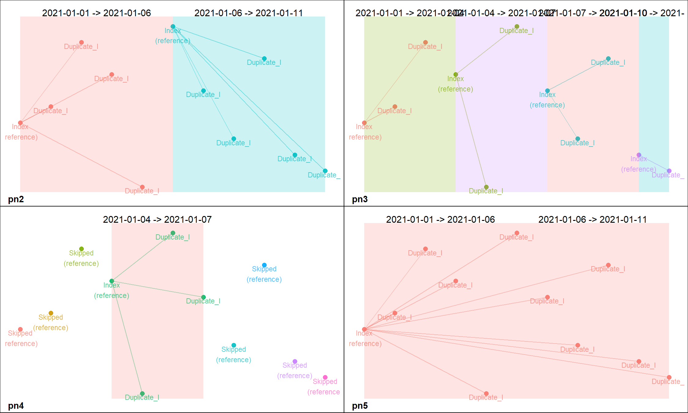

## Selecting index events and the direction of episode tracking

The `from_last` argument specifies the direction of episode tracking, while `custom_sort` specifies a custom preference for selecting index events. The combination of both allows users to choose which event or type of events should be used as the index event. See the examples below.
```{r warning=FALSE}
# Preference for selecting index events
c_sort <- c(rep(2, 5), 1, rep(2, 5))
# Episodes are 6 days (5-day difference) after the earliest event 
ep9 <- episodes(event_dt, case_length = 5, episodes_max = 1)
# Episodes are 6 days (5-day difference) before the most recent event 
ep10 <- episodes(event_dt, case_length = 5, episodes_max = 1, from_last = TRUE)
# Episodes are 6 days (5-day difference) after the 6th event 
ep11 <- episodes(event_dt, case_length = 5, custom_sort = c_sort, episodes_max = 1)
# Episodes are 6 days (5-day difference) before or after the 6th event 
ep12 <- episodes(event_dt, case_length = number_line(-5, 5), custom_sort = c_sort, episodes_max = 1)
```

```{r warning=FALSE, include=FALSE}
# plt1 <- schema(ep9, seed = 2, show_label = c("length_label", "length_arrow", "case_nm"), theme = "light")
# plt2 <- schema(ep10, seed = 2, show_label = c("length_label", "length_arrow", "case_nm"), theme = "light")
# plt3 <- schema(ep11, seed = 2, show_label = c("length_label", "length_arrow", "case_nm"), theme = "light")
# plt4 <- schema(ep12, seed = 2, show_label = c("length_label", "length_arrow", "case_nm"), theme = "light")
# 
# f <- plot_grid(plt1 + theme(plot.background = element_rect(color = "black")),
#                plt2 + theme(plot.background = element_rect(color = "black")),
#                plt3 + theme(plot.background = element_rect(color = "black")),
#                plt4 + theme(plot.background = element_rect(color = "black")),
#                labels = c("ep9", "ep10", "ep11", "ep12"), label_colour = "black")
# ggsave(plot = f, filename = "fig_e6.png", width = 15, height = 9, units = "in")
```

**Figure 6: Selecting index events when tracking episodes**


## Recurrence
The `episode_type` argument can be used to request for rolling or recursive episodes which permit recurrence. `reference_event` is used to specify which of the events in the existing episode is considered the reference event for the next recurrence. `case_for_recurrence` determines if the initial occurrence of the event and subsequent recurrences are to be treated in the same way i.e. does recurrent events trigger an initial occurrence of their own?

```{r warning=FALSE}
# Episodes are 4 days (3-day difference) after the earliest event with
# repeat occurrence within 4 days of the last event considered recurrences not duplicates
ep13 <- episodes(event_dt, case_length = 3, episode_type = "rolling")
# Episodes are 4 days (3-day difference) after the earliest event with
# repeat occurrence within 7 days of the last event considered recurrences not duplicates
ep14 <- episodes(event_dt, case_length = 3,  recurrence_length = 6, episode_type = "rolling")
# Episodes are 3 days (2-day difference) after the earliest event with
# repeat occurrence within 6 days of the first event considered recurrences not duplicates
ep15 <- episodes(event_dt, case_length = 2,  recurrence_length = 5, 
                episode_type = "rolling", reference_event = "first_record")
# Episodes are 2 days (1-day difference) after the earliest event with
# repeat occurrence within 4 days of the last event considered recurrences not duplicates and
# the possibility of each repeat occurrence spawning a new occurrence as if it was the initial case
ep16 <- episodes(event_dt, case_length = 1,  recurrence_length = 3, 
                episode_type = "rolling", case_for_recurrence = TRUE)
# Episodes are 2 days (1-day difference) after the earliest event with
# repeat occurrence within 4 days of the last event considered recurrences not duplicates and
# can't recur more than twice
ep17 <- episodes(event_dt, case_length = 1,  recurrence_length = 3, 
                episode_type = "rolling", rolls_max = 2)
# Episodes are 2 days (1-day difference) after the earliest event with
# repeat occurrence within 4 days of the last event considered recurrences not duplicates and
# can't recur more than once times and the selection of index events is recursive
ep18 <- episodes(event_dt, case_length = 1,  recurrence_length = 3, 
                episode_type = "recursive", rolls_max = 1)
```

```{r warning=FALSE, include=FALSE}
# plt1 <- schema(ep13, seed = 2, show_label = c("length_label", "length_arrow"), theme = "light")
# plt2 <- schema(ep14, seed = 2, show_label = c("length_label", "length_arrow"), theme = "light")
# plt3 <- schema(ep15, seed = 2, show_label = c("length_label", "length_arrow"), theme = "light")
# plt4 <- schema(ep16, seed = 2, show_label = c("length_label", "length_arrow"), theme = "light")
# plt5 <- schema(ep17, seed = 2, show_label = c("length_label", "length_arrow"), theme = "light")
# plt6 <- schema(ep18, seed = 2, show_label = c("length_label", "length_arrow"), theme = "light")
# 
# f <- plot_grid(plt1 + theme(plot.background = element_rect(color = "black")),
#                plt2 + theme(plot.background = element_rect(color = "black")),
#                plt3 + theme(plot.background = element_rect(color = "black")),
#                plt4 + theme(plot.background = element_rect(color = "black")),
#                plt5 + theme(plot.background = element_rect(color = "black")),
#                plt6 + theme(plot.background = element_rect(color = "black")),
#                labels = c("ep13", "ep14", "ep15", "ep16", "ep17", "ep18"),
#                label_colour = "black")
# ggsave(plot = f, filename = "fig_e7.png", width = 15, height = 9, units = "in")
```

**Figure 7: Recurrence of the index event**
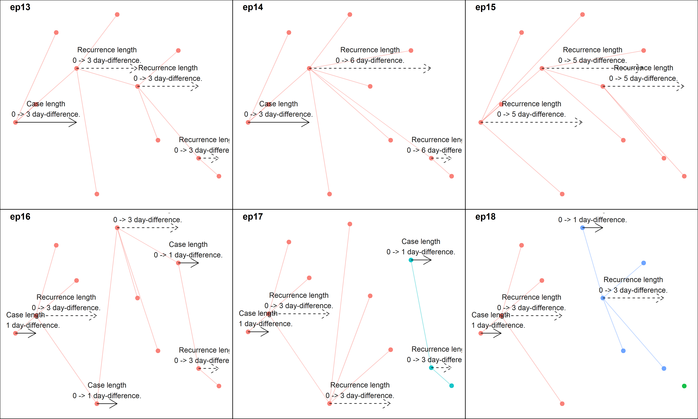

### Multiple temporal links and lags between the reference and repeat events
Multiple `case_length` or `recurrence_length` can be used by providing a `list` of ranges (`number_line()`), while the `case_length_total` and `recurrence_length_total` arguments specifies how many such temporal links are required for an episode.

```{r warning=FALSE}
# Each episodes requires at least 5 temporal links
ep19 <- episodes(event_dt,
                case_length = list(number_line(2, 2),
                                   number_line(5, 7),
                                   number_line(9, 20)),
                episode_type = "fixed", case_length_total = 5, skip_if_b4_lengths = TRUE)

# Each episodes requires at least 2 temporal links
ep20 <- episodes(event_dt,
                case_length = list(number_line(2, 2),
                                   number_line(5, 7),
                                   number_line(9, 20)),
                episode_type = "fixed", case_length_total = 2, skip_if_b4_lengths = TRUE)

```

```{r warning=FALSE, include=FALSE}
# plt1 <- schema(ep19, seed = 2,
#                show_label = c("length_label", "length_arrow", "case_nm"),
#                theme = "light")
# plt2 <- schema(ep20, seed = 2,
#                show_label = c("length_label", "length_arrow", "case_nm"),
#                theme = "light")
# 
# f <- plot_grid(plt1 + theme(plot.background = element_rect(color = "black")),
#                plt2 + theme(plot.background = element_rect(color = "black")),
#                labels = c("ep19", "ep20"),
#                label_colour = "black",
#                label_size = 12,
#                label_x = c(0, 0))
# ggsave(plot = f, filename = "fig_e8.png", width = 15, height = 4.5, units = "in")
```

**Figure 8: Lags between index and repeat events**
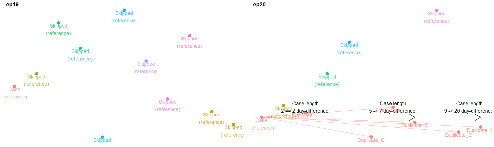

## Interval grouping
It's possible to track episodes among events with known start and end points, instead of those occurring at a single point in time. It is worth noting that the reference point for such events is their end point. Therefore, using a `case_length` of `1` when working with such events is interpreted as 2 days (1-day difference) after the end point of the interval. By default, other events that occur on or after the start point but before the end point of the index event will not be captured. If this is required, use `index_window()` to get the range required to capture such events, and supply it to the `case_length` or `recurrence_length` arguments. See the figure and examples below.
```{r warning=FALSE}
# Dummy data of hospital stays
dfr <- diyar::hospital_admissions[c("admin_dt", "discharge_dt")]
dfr$admin_period <- number_line(dfr$admin_dt, dfr$discharge_dt)
                                  
# Group overlapping hospital stays
dfr$ep_len1 <- index_window(dfr$admin_period)
ep21 <- episodes(date = dfr$admin_period, case_length = dfr$ep_len1)

# Group overlapping hospital stays and those within 21 days of the end point of an index hospital stay 
dfr$ep_len2 <- expand_number_line(index_window(dfr$admin_period), 20, "right")
ep22 <- episodes(date = dfr$admin_period, case_length =  dfr$ep_len2)

dfr
```

```{r warning=FALSE, include=FALSE}
# plt1 <- schema(ep21, seed = 2,
#                show_label = c("length_label", "length_arrow"), theme = "light")
# plt2 <- schema(ep22, seed = 2,
#                show_label = c("length_label", "length_arrow"), theme = "light")
# 
# f <- plot_grid(plt1 + theme(plot.background = element_rect(color = "black")),
#                plt2 + theme(plot.background = element_rect(color = "black")),
#                labels = c("ep21", "ep22"),
#                label_colour = "black",
#                label_size = 12,
#                label_x = c(0, 0))
# ggsave(plot = f, filename = "fig_e9.png", width = 15, height = 4.5, units = "in")
```

**Figure 9: Tracking episodes of overlapping intervals**
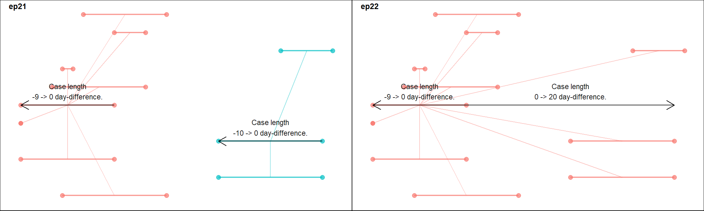

Currently, the `diyar` packages recognises 7 mutually exclusive and 2 mutually inclusive way intervals can overlap. Please see `vignette("number_line")` for more details about this. Using `case_overlap_methods` and `recurrence_overlap_methods`, the episode tracking process can be made to only capture intervals that overlap by specific methods. See the example below.

```{r warning=FALSE}
# Wrapper function for a fixed episode
episodes_wf <- function(x){
  epids <- episodes(date = dfr$admin_period, 
                    sn = dfr$rd_id, 
                    case_length = index_window(dfr$admin_period), 
                    case_overlap_methods = x)
  return(epids)
}

# Methods 
methods <- list(
  # Identical intervals
  exact = "exact",
  # Intervals with their start or end points within another
  across = "across",
  # Intervals with aligned start points
  aligns_start = "aligns_start",
  # Intervals with aligned end points
  aligns_end = "aligns_end",
  # Intervals with start points that align with the end point of another, and vice versa
  chain = "chain",
  # Intervals occurring completely within others
  inbetween = "inbetween",
  # A combination of `chain` and `inbetween` methods
  cb1 = "chain|inbetween",
  # A combination of `exact`, `chain` and `inbetween` methods
  cb2 = "exact|chain|inbetween",
  # A combination of `across`, `chain` and `aligns_end` methods
  cb3 = "across|chain|aligns_end"
)

epids <- lapply(methods, episodes_wf)
names(epids) <- methods

epids$exact
```

```{r warning=FALSE, include=FALSE}
# epids_schema <- lapply(epids, function(x){
#   schema(x, seed = 2, show_label = FALSE, theme = "light")
# })
# 
# f <- plot_grid(epids_schema[[1]] + theme(plot.background = element_rect(color = "black")),
#           epids_schema[[2]] + theme(plot.background = element_rect(color = "black")),
#           epids_schema[[3]] + theme(plot.background = element_rect(color = "black")),
#           epids_schema[[4]] + theme(plot.background = element_rect(color = "black")),
#           epids_schema[[5]] + theme(plot.background = element_rect(color = "black")),
#           epids_schema[[6]] + theme(plot.background = element_rect(color = "black")),
#           epids_schema[[7]] + theme(plot.background = element_rect(color = "black")),
#           epids_schema[[8]] + theme(plot.background = element_rect(color = "black")),
#           epids_schema[[9]] + theme(plot.background = element_rect(color = "black")),
#           labels = methods, label_colour = "black", ncol = 3,
#           label_x = c(.8,.75,.62,.65,.8,.65,.5,.32,.25))
# ggsave(plot = f, filename = "fig_e10.png", width = 15, height = 9, units = "in")
```

**Figure 10: Overlap methods**
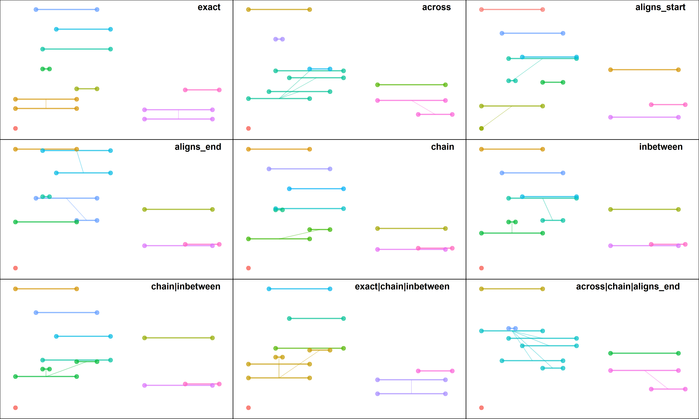

# Strengths and limitations
 `episodes()` is implemented as a loop. Although, the function continues to be optimised, each iteration of the loop costs additional processing time. This can be further compounded by the number of records being assessed. The exact time taken to complete an iteration will depend on a machine's specifications but the number of iterations required to complete the tracking process is constant. The time difference due to an additional iteration will be negligible when analysing small datasets but can become noticeable with much larger datasets.

In general, this issue can be mitigated by reducing the number of iterations required to complete the episode tracking process. There are two ways of achieving this. These are summarised below. 

## Efficient use of arguments
Different combinations of arguments can lead to the same outcome however, each will often require different number of iterations to complete the same process. In general, shorter and multiple `case_length` and `recurrence_length`, fewer `strata`, and the use of `custom_sort`, a `sub_criteria` and multiple index events will increase the number of iterations required to complete the process. A good understanding of each argument will be beneficial in knowing the most efficient combination of arguments to use for a case definition. For example, `ep4` was created with a `sub_criteria` and took 9 iterations to complete.

```{r warning=FALSE}
summary(ep4)
```
However, if the `strata` argument is used instead of a `sub_criteria`, it only takes 2 iterations and yet achieves the same outcome.

```{r warning=FALSE}
ep4b <- episodes(event_dt, case_length = 5, strata = paste0(attr_1, " ", attr_2))

summary(ep4b)

# Identical identifiers 
all(ep4 == ep4b)
```

Similarly, using multiple index events usually costs additional processing time, even if it takes the same number of iterations to complete the same process. See the examples below.

```{r warning=FALSE}
dup_events <- rep(event_dt, 5)
# Fast
system.time(
  ep23a <- episodes(dup_events, case_length = 5, episode_type = "recursive")  
)
# Faster
system.time(
  ep23b <- episodes(dup_events, case_length = 5, episode_type = "rolling", 
                  reference_event = "last_event")  
)
# Fastest
system.time(
  ep23c <- episodes(dup_events, case_length = 5, episode_type = "rolling", 
                  reference_event = "last_record")  
)
```

```{r warning=FALSE, include=FALSE}
# plt1 <- schema(ep23a, seed = 2, show_label = c("length_label", "length_arrow"), theme = "light")
# plt2 <- schema(ep23b, seed = 2, show_label = c("length_label", "length_arrow"), theme = "light")
# plt3 <- schema(ep23c, seed = 2, show_label = c("length_label", "length_arrow"), theme = "light")
# f <- plot_grid(plt1 + theme(plot.background = element_rect(color = "black")),
#                plt2 + theme(plot.background = element_rect(color = "black")),
#                plt3 + theme(plot.background = element_rect(color = "black")),
#                labels = c("Fast (ep23a)",
#                           "Faster (ep23b)",
#                           "Fastest (ep23c)"),
#                label_colour = "black",
#                label_size = 12,
#                label_x = c(0.6, 0.6, 0.6),
#                label_y = c(0.07, 0.07, 0.07),
#                nrow = 1)
# ggsave(plot = f, filename = "fig_e11.png", width = 15, height = 4.5, units = "in")
```

**Figure 11: Effect of using multiple index events**
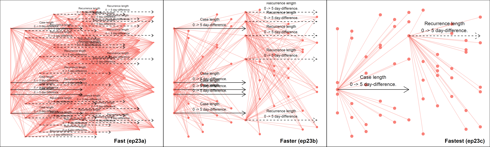

Therefore, unless required, multiple index events should be avoided.

### Stop episode tracking
`episode_max`, `rolls_max` and `skip_order` are arguments used to stop the episode tracking process once certain conditions are met. By doing this, the total number of iterations and processing time is therefore reduced. `episodes_max` specifies the maximum number of episodes required from a `strata`. `rolls_max` specifies the number of recurrences an index case is allowed. `skip_order` stops the episode tracking process when all records with the `nth` level of a `custom_sort` have been linked to an episode. `skip_order` is particularly useful when tracking rare events among other common events. Once all rare events have been tracked, the process is stopped. The example below has a mix of two `"Rare"` events and 20 `"Common"` events, and takes 11 iterations to complete.

```{r warning=FALSE}
# Attribute 4 - Frequency
attr_4 <- c(rep("Common", 5), "Rare", rep("Common", 12), "Rare", rep("Common", 3))
attr_4 <- factor(attr_4, levels = c("Rare", "Common"))

dup_events_2 <- rep(event_dt, 2)
ep24a <- episodes(dup_events_2, case_length = 0, custom_sort = attr_4, data_source = attr_4)
summary(ep24a)
```

However, if a user is only interested in episodes with `"Rare"` events, `skip_order` can be used to stop the process when all `"Rare"` events (1^st^ level of `custom_sort`) have been assigned to an episode. This takes 3 iterations to complete the process, skipping 8 iterations that would have produced episodes without `"Rare"` events.

```{r warning=FALSE}
ep24b <- episodes(dup_events_2, case_length = 0, custom_sort = attr_4, skip_order = 1, 
                  data_source = attr_4)

summary(ep24b)
```

```{r warning=FALSE, include=FALSE}
# plt1 <- schema(ep24a, seed = 2,
#                show_label = FALSE,
#                custom_label = attr_4, theme = "light")
# plt2 <- schema(ep24b, seed = 2,
#                show_label = FALSE,
#                custom_label = attr_4, theme = "light")
# 
# f <- plot_grid(plt1 + theme(plot.background = element_rect(color = "black")),
#                plt2 + theme(plot.background = element_rect(color = "black")),
#                labels = c("ep24a", "ep24b"),
#                label_colour = "black",
#                label_size = 12,
#                label_x = c(0, 0))
# ggsave(plot = f, filename = "fig_e12.png", width = 15, height = 4.5, units = "in")
```

**Figure 12: Using `skip_order` to stop the episode tracking process**
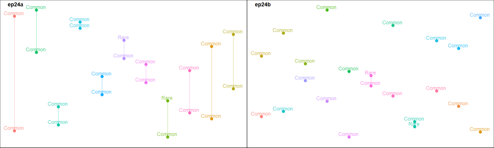

# Miscellaneous tips
## Tracking episodes in other units of time
Episodes can be tracked in other units of time using the `episode_unit` argument. Acceptable options are `"seconds"`, `"minutes"`, `"hours"`, `"days"`, `"weeks"`, `"months"` or `"years"`. Below is an example of episode tracking by the hour compared to tracking them by day (default).

```{r warning=FALSE, message=FALSE}
dbs <- diyar::hourly_data

# Each unit is relative to a predefined number of seconds. 
diyar::episode_unit

# 1-day fixed episodes
episodes(date = dbs$datetime,  case_length = 1, episode_unit = "days", group_stats = TRUE)

# 5-hr fixed episodes
episodes(date = dbs$datetime, case_length = 5, episode_unit = "hours", group_stats = TRUE)
```

### Familiar identifiers and `pid` objects for `strata`
See the example below.

```{r warning=FALSE, message=FALSE}
dbs <- diyar::infections[c("date", "infection")]; dbs

# Familiar unique record ids use for the identifiers - optional
dbs$rd_id <- c(640, 17, 58, 21, 130, 79, 45, 300, 40, 13, 31)

# `strata` based on matching sources of infection
dbs$pids <- links(sn = dbs$rd_id, criteria = dbs$infection)

dbs$epids <- episodes(sn = dbs$rd_id, date = dbs$date, strata = dbs$pids, case_length = 10)

dbs
```

## Use numeric values for the date argument 
`numeric` values can be supplied to the `date` argument. In such cases, the `episode_unit` argument is ignored.

```{r warning=FALSE, message=FALSE}
vals <- c(8.1, 6, 12, 8.5, 12, 3, 8, 15, 5, 7)
vals

episodes(date = vals, case_length = .5, group_stats = TRUE)

episodes(date = vals, case_length = 5, group_stats = TRUE)

episodes(date = vals, case_length = 100, group_stats = TRUE)
```

### Infinite and missing `case_length` or `recurrence_length`
You can incorporate missing and infinite cut-offs into your analyses. Events with missing cut-offs will not be used as an index event however, they can be tagged as a duplicate of another index event. Index events with an infinite cut-off will be linked to every other event in its `strata`.

```{r warning=FALSE, message=FALSE}
vals <- 1:10
episodes(date = vals, case_length = Inf)

episodes(date = vals, case_length = NA_real_)
```
