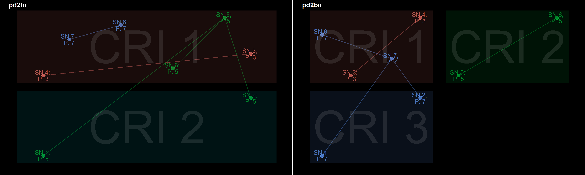
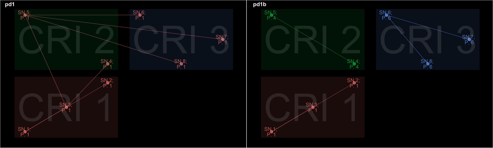

```{r setup, include = FALSE}
knitr::opts_chunk$set(
  collapse = TRUE,
  comment = "#>"
)
```

```{r, include = FALSE}
library(diyar); 
# library(cowplot)
# library(ggplot2)
```

# Introduction
Linking datasets to consolidate information is a common task in research. Deterministic and probabilistic linkage are the two most common methods of record linkage. Deterministic record linkage is the simplest of both methods but its accuracy relies heavily on good data quality. In contrast, probabilistic record linkage improves on this by using several methods to identify, validate and score matches among datasets of varying data quality. However, probabilistic record linkage can be complex to implement and computationally intensive. Multistage deterministic record linkage is an approach that lies between both methods. Here, matches are identified in successive stages of different matching conditions. This makes the process more robust than a simple deterministic linkage but not typically as complex or as computationally intensive as probabilistic record linkage.

`links()` provides a convenient and flexible approach to implementing multistage deterministic record linkage in `R`. It allows a user to specify what constitutes a match e.g. similarity scores, text transformations or partial string matches etc. It also has mechanisms to address missing data and conflicting matches across successive stages of the linkage process. 

# Overview
The `links()` function assigns records to unique record-groups based on a set of matching criteria. These are stored as a `pid` object which is essentially a group identifier with additional information about each group stored in the slots of the `pid` object. See an example below.

```{r warning = FALSE}
## 3-stage linkage
# Attributes to be compared at each stage
attr_1 <- c(1, 1, 1, NA, NA, NA, NA, NA)
attr_2 <- c(NA, NA, 2, 2, 2, NA, NA, NA)
attr_3 <- c(NA, NA, NA, NA, 3, 3, 3, 3)
stages <- list(attr_1 = attr_1, attr_2 = attr_2, attr_3 = attr_3)
# Source of each record 
data_sets <- c("A", "A", "A", "A", "B", "B", "B", "B")
# Dataset
dfr <- cbind(as.data.frame(stages), data_sets)
# Linkage
dfr$pd1 <- links(stages, data_source = data_sets)
# Identifiers
dfr
```

There are `as.data.frame` and `as.list` methods for easy access to components of a `pid` object.
```{r warning = FALSE}
# Components of a `pid` identifier
as.data.frame(dfr$pd1)
```

# Implementation
At each stage, records are linked if their values are an `exact_match()`. By default, the priority of matches decreases with each subsequent stage i.e. matches at the 1^st^ stage are superior and will not be overwritten by matches at the 2^nd^ stage. Records with missing (`NA`) or unmatched values are skipped at each stage, while another attempt to match them is made in the next stage of the process. 

At each stage, additional matching criteria can be supplied with a `sub_criteria` object. A `sub_criteria` contains a set of attributes to be compared, corresponding logical tests for each attribute and corresponding logical tests for the equivalence of values in each attribute. Nested conditions is also possible by nesting a `sub_criteria`. Every `sub_criteria` must be linked to a stage (`criteria`). This is done by supplying every `sub_criteria` as a named `list` . Each element's name must correspond to a stage. For example, `"cr1"` and `"cr13"` correspond to stages 1 and 13 respectively. Any unlinked `sub_criteria` will be ignored.

Records are assessed in iterations. If a stage has no `sub_criteria`, it will take one iteration to complete the stage. If a stage has a `sub_criteria`, multiple iterations maybe required to complete that stage.

## Match priority
By default, a match at one stage is always superior to a match at the next stage. Additionally, records with missing or unmatched values are skipped at each stage of the process. In the example below, by stage 1, records 1, 2 and 7 are either missing or unmatched values. Therefore, they are skipped at stage 1 but subsequently linked together at stage 2 due to matching dates of birth with records 5 and 6. 

```{r warning = FALSE}
# Attribute - Names
attr_4 <- c(NA, NA, "James", "James", "Tobi", "Tobi", "Ope")
# Date of birth 
attr_5 <- c("12/04/1957", "12/04/1957", "22/06/1973", "20/01/1980",
            "12/04/1957", "12/04/1957", "12/04/1957")
# Dataset
stages_2 <- list(attr_4 = attr_4, attr_5 = attr_5)

dfr_2 <- as.data.frame(stages_2)
dfr_2$pd2 <- links(stages_2)

dfr_2
```

In contrast, a set of records matched at a particular stage will remain linked for the rest to the linkage process even if their values at subsequent stages are different. This was the case with records 3 and 4. 

To maintain this match priority, introducing a new record that permits a match at an earlier stage will result in records being transferred between groups. In the example below, a new `"Ope"` record is introduced and linked to the existing `"Ope"` record. However, a consequence of this change is that at stage 2 (matching dates of birth), records 1 and 2 have the option of either being linked to the `"Ope"` or `"Tobi"` records. Usually, they will be linked to the `"Ope"` records because the link between `"Ope"` records is considered to have a higher priority (stage 1) than that of the `"Tobi"` records (stage 2). However, if the `"Ope"` and `"Tobi"` records were linked at the same stage (see `pd2bii`), priority is given to the first group the process encounters.

```{r warning = FALSE}
attr_4c <- attr_4b <- c(attr_4, "Ope")
attr_4c[attr_4c == "Tobi"] <- NA
attr_5b <- c(attr_5, "13/02/1991")
# Attribute - Sex
attr_4.5 <- c(NA, NA, NA, NA, "M", "M", NA, NA)

stages_2bi <- list(attr_4b = attr_4b, attr_5b = attr_5b)
stages_2bii <- list(attr_4c = attr_4c, attr_4.5 = attr_4.5, attr_5b = attr_5b)
# Dataset 1
dfr_2b <- as.data.frame(stages_2bi)
# Linkage option 1
dfr_2b$pd2bi <- links(stages_2bi)

# Dataset 2
dfr_2c <- as.data.frame(stages_2bii)
# Linkage option 2
dfr_2c$pd2bii <- links(stages_2bii)

# Results for option 1
dfr_2b

# Results for option 2
dfr_2c
```

```{r warning = FALSE, include = FALSE}
# plt1 <- schema(dfr_2b$pd2bi, seed = 2,
#                show_label = TRUE,
#                theme = "dark")
# plt2 <- schema(dfr_2c$pd2bii, seed = 2,
#                show_label = TRUE,
#                theme = "dark")
# 
# f <- plot_grid(plt1 + theme(plot.background = element_rect(color = "white")),
#                plt2 + theme(plot.background = element_rect(color = "white")),
#                labels = c("pd2bi", "pd2bii"),
#                label_colour = "white",
#                label_size = 12,
#                label_x = c(0, 0))
# ggsave(dpi = 100, plot = f, filename = "fig_p1.png", width = 15, height = 4.5, units = "in")
```

**Figure 1: Effect of a change to the match priority**


## Multistage matches
By default, a record-group gains more records as new matches are identified in subsequent stages. This results in an acceptable but decreasing specificity with each stage. Changing `expand` to `FALSE` will restrict matches to those occurring at the same stage of the linkage process. Figure 2 and the example below shows this difference as compared to the earlier example (`dfr$pd1`) where `expand` was `TRUE`.

```{r warning = FALSE}
dfr$pd1b <- links(stages, expand = FALSE)
dfr
```

```{r warning = FALSE, include = FALSE}
# plt1 <- schema(dfr$pd1, seed = 2, theme = "dark")
# plt2 <- schema(dfr$pd1b, seed = 2, theme = "dark")
# f <- plot_grid(plt1 + theme(plot.background = element_rect(color = "white")),
#                plt2 + theme(plot.background = element_rect(color = "white")),
#                labels = c("pd1", "pd1b"),
#                label_colour = "white",
#                label_size = 12)
# ggsave(dpi = 100, plot = f, filename = "fig_p2.png", width = 15, height = 4.5, units = "in")
```

**Figure 2: Group expansion** 


 
In contrast, when `shrink` is `TRUE`, record-groups lose records as new matches are identified in subsequent stages. This results in increasing specificity with each stage. At a given stage, if all records in a record-group have missing or non-matching values, the record-group will not change otherwise, it is split into subgroups with matching `criteria` (and `sub_criteria` where applicable). Note that the `expand` and `shrink` functionalities are not complimentary i.e. the outcome when `expand` is `FALSE` is not always the same outcome when `shrink` is `TRUE`. However, when `shrink` is `TRUE`, `expand` is automatically set to `FALSE` regardless of the user's input. See an example of this difference below.

```{r warning = FALSE}
# Attributes to be compared at each stage
attr_6 <- c(1, 1, 1, 1, 2, 2, 2, 2)
attr_7 <- c(NA, NA, 2, 2, NA, NA, NA, NA)
attr_8 <- c("3c", "3c", "3c", "3c", "3a", "3a", "4a", "4b")
stages_3 <- list(attr_6 = attr_6, attr_7 = attr_7, attr_8 = attr_8)

dfr_3 <- cbind(as.data.frame(stages_3))
dfr_3$pd3a <- links(stages_3, expand = FALSE)
dfr_3$pd3b <- links(stages_3, shrink = TRUE)

dfr_3
```
 
## Sub-criteria
The `sub_criteria` argument is used to supply additional matching conditions to a stage of the linkage process. This helps strengthen `criteria` match rules. All `sub_criteria` must be linked to a `criteria`. If there's no `criteria`, a place holder can be used in its place (see `dfr_4$pd5`). In the example below, additional matching criteria are used to strengthen a linkage on identical `name` values.

```{r warning = FALSE}
data(Opes); Opes

# `criteria` AND matching department
sub_cri_1 <- sub_criteria(Opes$department)
# `criteria` AND matching (department OR hair_colour)
sub_cri_2 <- sub_criteria(Opes$department, Opes$hair_colour)
# `criteria` AND matching (department AND hair_colour AND date_of_birth)
sub_cri_3 <- sub_criteria(Opes$department, Opes$hair_colour, Opes$date_of_birth, operator = "and")
# `criteria` AND matching ((department OR hair_colour) AND date_of_birth)
sub_cri_4 <- sub_criteria(sub_cri_2, Opes$date_of_birth, operator = "and")
# `criteria` AND matching (any two parts of the date of birth)
sub_cri_5 <- sub_criteria(Opes$db_pt1, Opes$db_pt2, Opes$db_pt3)

Opes$pd4a <- links(criteria = Opes$name, sub_criteria = list(cr1 = sub_cri_1))
Opes$pd4b <- links(criteria = Opes$name, sub_criteria = list(cr1 = sub_cri_2))
Opes$pd4c <- links(criteria = Opes$name, sub_criteria = list(cr1 = sub_cri_3))
Opes$pd4d <- links(criteria = Opes$name, sub_criteria = list(cr1 = sub_cri_4))
Opes$pd4e <- links(criteria = list(Opes$name, Opes$name),
                     sub_criteria = list(cr1 = sub_cri_4,
                                         cr2 = sub_cri_5))

Opes[c("name", "department", "hair_colour", "date_of_birth", 
       "pd4a", "pd4b", "pd4c", "pd4d", "pd4e")]

```
Attributes in a `sub_criteria` can be compared with user defined logical tests. These are supplied to the `match_funcs` argument of `sub_criteria()`. Regardless of the complexity of these tests, they must meet 3 requirements:

+    They must be able to compare two atomic vectors.
+    They must have two arguments named `x` and `y`, where `y` is the value for one observation being compared against the value of all other observations - `x`.
+    They must return either `TRUE` or `FALSE`.

A relatively simple use case for this functionality is to compare attributes with string comparators. The example below uses Jaro-Winkler and soundex similarities scores for a pair of values to determine matches and non-matches. These similarity scores are calculated using the `stringdist` package.

```{r warning = FALSE}
data(staff_records); 
dfr_4 <- staff_records[c("forename")]
dfr_4$forename

# Logical test 1 - Similarity score of 70% or more 
jw_func <- function(x, y){
  score <- 1 - stringdist::stringdist(x, y, "jw")
  score > .7
}

# Logical test 2 - Matching Soundex
soundex_func <- function(x, y){
  score <- 1 - stringdist::stringdist(x, y, "soundex")
  as.logical(score)
}

sub_cri_6 <- sub_criteria(dfr_4$forename, dfr_4$forename, 
                          match_funcs = c(jw_func, soundex_func),
                          operator = "or")
dfr_4$pd5 <- links(criteria = "place_holder", sub_criteria = list(cr1 = sub_cri_6))
dfr_4
```

### Probabilistic record linkage
The complexity of a user-defined logical test can range from relatively simple use cases to complex ones such as that implemented in `links_wf_probabilistic()`. `links_wf_probabilistic()` is a wrapper function of `links()` using a specific `sub_criteria` to achieve probabilistic record linkage. There are a few differences between `links_wf_probabilistic()` and the typical implementation of probabilistic record linkage. These are summarised below.

**Table 1: Differences between the typical approach to probabilistic record linkage and `links_wf_probabilistic()`.**

Aspects | Typical approach | `links_wf_probabilistic()`
------------- | ------------- | -------------
Implementation | Every possible record pair is created before being compared | Sets of record pairs are created and compared in iterations 
Score-thresholds | Chosen after review of all matches | Required before the linkage process
Accepted matches | Chosen after review of all matches | Chosen within each iteration of the linkage process

Due to these differences, there are two functionalities to help select a score-threshold before the actual linkage. The first is to use `prob_score_range()` to review the range of scores attainable for a given dataset. The second is to use the `id_1` and `id_2` arguments to return the scores for specific record pairs. Calculation of the score-threshold is based on Fellegi and Sunter (1969) model for deciding if two records belong to the same entity. See `help(links_wf_probabilistic)` for a more detailed explanation of the implementation of this method. See below for examples of how `links_wf_probabilistic()` can be used.

```{r warning = FALSE}
data(missing_staff_id); 
dfr_5 <- missing_staff_id[c("staff_id",  "initials", "hair_colour", "branch_office")]
dfr_5
score_range <- prob_score_range(attribute = as.list(dfr_5))
score_range

# Logical test - Matching last word in `hair_colour` and `branch_office`
last_word_wf <- function(x) tolower(gsub("^.* ", "", x))
last_word_cmp <- function(x, y) last_word_wf(x) == last_word_wf(y)
prob_pids2 <- links_wf_probabilistic(attribute = as.list(dfr_5),
                                     cmp_func = c(diyar::exact_match,
                                                  diyar::exact_match,
                                                  last_word_cmp,
                                                  last_word_cmp),
                                     score_threshold = score_range$mid_scorce)
prob_pids2

# Results for specific record pairs
prob_pids3 <- links_wf_probabilistic(attribute = as.list(dfr_5),
                                     cmp_func = c(diyar::exact_match,
                                                  diyar::exact_match,
                                                  last_word_cmp,
                                                  last_word_cmp),
                                     score_threshold = score_range$mid_scorce,
                                     id_1 = c(1, 1, 1),
                                     id_2 = c(6, 7, 4))
prob_pids3
```

Similar wrapper functions can be written to implement other type of EM algorithms.

# Strengths and limitations

`links()` is primarily designed for multistage record linkage and offers convenience in handling complex matching conditions and missing data. The more complex the scenario, the more likely its convenience outweighs the complexity of scripting these complex issues. Simple matching conditions or one-stage linkages are possible with `links()` but will take slightly more time than base `R` alternatives (see `pd_8e`).

`links()` is implemented as a loop. Each `criteria` costs one iteration, while a `sub_criteria` costs as many iterations as it takes to compare all record pairs. The time taken to complete one iteration can differ in different machines however, the number of iterations required to complete the linkage process is constant for the same set of linkage criteria and options. Regardless, each additional iteration costs additional processing time. There are three main ways of reducing the number of iterations required to completed the linkage process. These are summarised below.

## Use a strata or criteria instead of a sub-criteria
Where possible, express a `sub_criteria` as a `criteria`. A `sub_criteria` with an `exact_match()` as its logical test(s) and an `"and"` operator should be expressed as a `criteria`. For example, `Opes$pd4c` was created with a `sub_criteria` and it took 8 iterations to complete the process. 

```{r warning = FALSE}
summary(Opes$pd4c)
```

However, the same outcome can be achieved with a `criteria` and will only take one iteration to complete the same process
```{r warning = FALSE}
new_cri <- paste0(Opes$department, Opes$hair_colour, Opes$date_of_birth, sep = "-")
new_cri <- paste0(Opes$name, " ", new_cri)
Opes$pd4c2 <- links(criteria = new_cri)

max(Opes$pd4c2@iteration)

# Same outcome - identical identifiers 
Opes$pd4c; Opes$pd4c2
```

Similarly, the `strata` argument can also be used to supply a blocking attribute that restricts the linkage process to subsets of the dataset. This results in fewer iterations. 

## Reduce the number of logical tests in a `sub_criteria`
It costs additional processing time to implement each logical test in a `sub_criteria`. Where possible, multiple logical tests should be condensed into few sets, particularly if they are to be used on the same attribute. In the `dfr_4$pd5` example, the `jw_func` and `soundex_func` logical tests can be rewritten as `jw_soundex_func` and will lead to the same outcome as `dfr_4$pd5`.  

```{r warning = FALSE}
# Logical test - Similarity score of 70% or more OR matching Soundex
jw_soundex_func <- function(x, y) jw_func(x, y) | soundex_func(x, y)

sub_cri_6b <- sub_criteria(dfr_4$forename, match_funcs = jw_soundex_func)
dfr_4$pd5b <- links(criteria = "place_holder", sub_criteria = list(cr1 = sub_cri_6b))

# Same outcome - identical identifiers
all(dfr_4$pd5 == dfr_4$pd5b)
```

The relative simplicity of this logical test and the small number of records being assessed results in a very negligible time difference between both approaches. However, this time difference will become more apparent with larger datasets and more complex logical tests. 

## Reduce the number of records being assessed
The easiest way of doing this is to exclude duplicate records prior to the linkage process. These duplicate rows can be linked back to the group identifier if they are indexed before exclusion. In addition, there are two functionalities handled by the `recursive` and `check_duplicates` arguments, which aim to use the minimum number of records possible for the linkage process without affecting the match priority. These are described in the section below.

### `check_duplicates`
At a given stage, when a value of an attribute (`y`) is checked against all other values (`x`), it often does not need to be checked again. Therefore, duplicate values of `y` can be skipped. This is the default behaviour for `links()`. In the example below, doing this takes 1 iteration compared to 10 iterations when `check_duplicates` is set to `TRUE`.

```{r warning = FALSE}
# Dataset 
dfr_6 <- data.frame(attr_1 = rep(1, 10))
# Logical test - Absolute difference between values is > 0
rng_1p_func <- function(x, y) abs(y - x) > 0
sub_cri_7 <- sub_criteria(dfr_6$attr_1, match_funcs = rng_1p_func)

dfr_6$pd_7a <- links("place_holder", sub_criteria = list("cr1" = sub_cri_7),
                     check_duplicates  = TRUE)
dfr_6$pd_7b <- links("place_holder", sub_criteria = list("cr1" = sub_cri_7),
                     check_duplicates  = FALSE)

# Same outcome - identical identifiers
all(dfr_6$pd_7a == dfr_6$pd_7b)

# but different number of iterations
max(dfr_6$pd_7a@iteration); max(dfr_6$pd_7b@iteration)
```

To achieve this, logical tests have to be passed to the `equal_funcs` argument when creating the relevant `sub_criteria`. These are used to identify duplicate values which will then be skipped regardless of if they are linked or not. By default, this is also an `exact_match()` but might need to be changed if the attributes are not one of the 6 basic atomic vector types. Additionally, only records with duplicate values in all attributes are skipped. If a second attribute is added making the combination less unique, fewer records will be skipped. This is because the new combination of attributes may yield matches. In the example below, setting `check_duplicates` to `FALSE` now takes 3 iterations because there were fewer duplicate combinations of `attr_1` and `attr_2`.

```{r warning = FALSE}
# Attribute 2
dfr_6$attr_2 <- c(rep(1, 3), rep(2, 3), rep(3, 4))
# logical test - Difference between values is > 0
rng_1p_func <- function(x, y) y - x > 0

sub_cri_8 <- sub_criteria(dfr_6$attr_1, dfr_6$attr_2, match_funcs = rng_1p_func,
                          equal_funcs = diyar::exact_match)

dfr_6$pd_7c <- links("place_holder", sub_criteria = list("cr1" = sub_cri_8),
                     check_duplicates  = TRUE)
dfr_6$pd_7d <- links("place_holder", sub_criteria = list("cr1" = sub_cri_8),
                     check_duplicates  = FALSE)

# Same outcome - identical identifiers
all(dfr_6$pd_7c == dfr_6$pd_7d)

# but different number of iterations
max(dfr_6$pd_7c@iteration); max(dfr_6$pd_7d@iteration)
```

### `recurisve`
Matching records can either be included or excluded from subsequent iteration of the checks within the same `criteria` or stage of the linkage process. Excluding such records ultimately reduces the overall processing time but this can lead to different outcomes depending on the nature of the attribute being compared. If the attribute is to be compared in such a way that matching records can spawn new matches, having `recurisve` as `FALSE` will miss these links. The example below demonstrates this. 

```{r warning = FALSE}
# Dataset 
dfr_7 <- data.frame(attr_1 = 1:10, stringsAsFactors = FALSE)
# Logical test - Absolute difference of less than 4
rng_l4_func <- function(x, y) abs(y - x) < 4
sub_cri_9 <- sub_criteria(dfr_7$attr_1, match_funcs = rng_l4_func)

dfr_7$pd_8a <- links("place_holder", sub_criteria = list("cr1" = sub_cri_9), recursive  = TRUE)
dfr_7$pd_8b <- links("place_holder", sub_criteria = list("cr1" = sub_cri_9), recursive  = FALSE)

# Different outcomes - different identifiers
dfr_7

# and different number of iterations
max(dfr_7$pd_8a@iteration); max(dfr_7$pd_8b@iteration)
```
In contrast, if the attributes are to be compared in such a way that matches will not spawn new matches, then having `recurisve` as `FALSE` will lead to the same outcome but with the added benefit of taking fewer iterations to complete the same process. The example below demonstrates this. `attr_10` contains 26 unique values therefore, 26 iterations are required to complete the linkage based on exact matches. However, if `recursive` is `TRUE` then at each iteration 260,000 records are assessed. In contrast, when `recursive` is `FALSE` then 10,000 less records are assessed at each subsequent iteration.  

```{r warning = FALSE}
# dataset 
attr_10 <- rep(LETTERS, 10000)
sub_cri_10 <- sub_criteria(attr_10)

# Fast
system.time(
  pd_8c <- links("place_holder", sub_criteria = list("cr1" = sub_cri_10),
                 recursive = TRUE)
)

# Faster
system.time(
  pd_8d <- links("place_holder", sub_criteria = list("cr1" = sub_cri_10),
                 recursive = FALSE)
)

# Fastest
system.time(
  pd_8e <- match(attr_10, attr_10)
)

# Same outcomes - identical identifiers
all(pd_8c == pd_8d) & all(pd_8c == pd_8e)

# and same number of iterations
max(pd_8c@iteration); max(pd_8d@iteration)
```
As mentioned earlier, simple one-stage linkages such as the example above can be more efficiently handled with base `R` alternatives as shown with `pd_8e`. However, in this instance, `links()` has been used to demonstrate its `recursive` feature, which can also be used in more complex multistage linkages.
