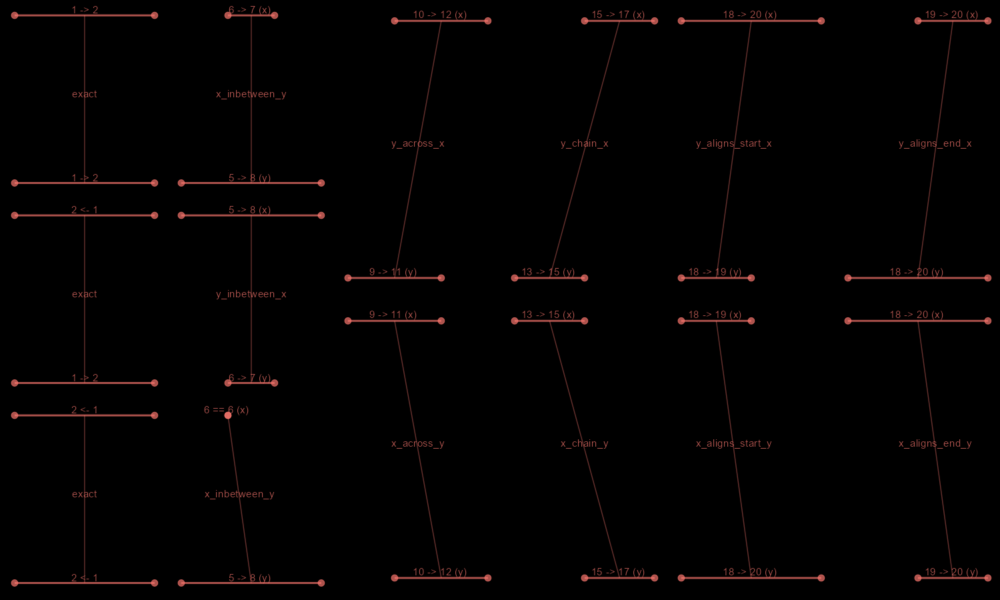

```{r setup, include = FALSE}
knitr::opts_chunk$set(
  collapse = TRUE,
  comment = "#>"
)
```

```{r include = FALSE}
library(diyar)
# library(ggplot2)
# library(cowplot)
```

# Introduction
A `number_line` object is a range of `numeric` values. `number_line` objects as based off `interval` objects from the `lubridate` package but supports any object that can be successfully coerced to a `numeric` object.

# Overview
```{r include = FALSE}
library(diyar)
exp <- number_line(8, 1)
```

For a given `number_line` object e.g. ``r format(exp)``, its main components are;

+ `left_point()` - left side of the `number_line` `i.e.` ``r left_point(exp) `` 
+ `right_point()` - right side of the `number_line` `i.e.` ``r right_point(exp) ``
+ `start_point()` - lower end of the range `i.e.` ``r start_point(exp) ``
+ `end_point()` - upper end of the range `i.e.` ``r end_point(exp) ``
+ `direction` - `"decreasing"` `(<-)`, `"increasing"` `(->)` or no direction `(==)`
+ `number_line_width()` - difference between the left and right points `i.e.` ``r number_line_width(exp) ``

For an `"increasing"` `number_line`, its `start_point()` is at the `left_point()`. In contrast, the `start_point()` of a `"decreasing"` `number_line` is at the `right_point()`.

```{r message = FALSE, warning = FALSE}
library(diyar)
# `number_line` objects
nl_a <- number_line(l = c(3, 5), r = c(4, 1))
nl_a

# Lower end of the range
start_point(nl_a)
# Left part of the range
left_point(nl_a)
```

# Implementation

## Manipulating a `number_line`
There are convenience functions to reverse, shrink, expand or shift a `number_line` along the number line.

```{r message = FALSE, warning = FALSE}
nl_c <- number_line(as.Date("2019-04-04"), as.Date("2019-4-07"))
nl_c

# Expand the `number_line` by 2 days from both ends 
nl_d <- expand_number_line(nl_c, 2); nl_d

# Expand the `number_line` by 2 days from the lower end only
nl_e <- expand_number_line(nl_c, 2, "start"); nl_e

# Shrink the `number_line` by 2 days from the upper end only
nl_f <- expand_number_line(nl_c, -2, "end"); nl_f

# Shrink the `number_line` by 2 days from both ends
nl_g <- expand_number_line(nl_c, -2); nl_g

# Reverse the direction of the `number_line`
nl_h <- reverse_number_line(nl_c); nl_h

# Shift the `number_line` towards the negative end of the number line by 2 days 
nl_i <- shift_number_line(nl_c, -2); nl_i

# Shift the `number_line` towards the positive end of the number line by 2 days 
nl_j <- shift_number_line(nl_c, 2); nl_j

# Change the left part of the `number_line` to a negative value
nl_k <- invert_number_line(nl_c, "left"); nl_k

# Split a `number_line`
nl_l <- seq(nl_c, length.out = 3); nl_l
```

## Overlaps
`number_line` objects can overlap with each other. `diyar` recognises seven ways this can happen. These are `exact()`, `inbetween()`, `across()`, `chain()`, `aligns_start()` and `aligns_end()`. The 6 methods are mutually exclusive. There are 2 convenience methods - `"none"` and `overlap()`, which are mutually inclusive with the other 6. See Figure 1.

```{r warning=FALSE, include=FALSE}
#  exact <- c(number_line(1, 2), number_line(1, 2),
#            number_line(2, 1), number_line(2, 1),
#            number_line(1, 1), number_line(1, 1))
# inbetween <- c(number_line(5, 8), number_line(6, 7),
#                number_line(6, 7), number_line(5, 8),
#                number_line(5, 8), as.number_line(6))
# across <- c(number_line(9, 11), number_line(10, 12),
#             number_line(10, 12), number_line(9, 11))
# chain <- c(number_line(13, 15), number_line(15, 17),
#            number_line(15, 17), number_line(13, 15))
# aligns_start <- c(number_line(18, 20), number_line(18, 19),
#                   number_line(18, 19), number_line(18, 20))
# aligns_end <- c(number_line(18, 20), number_line(19, 20),
#                 number_line(19, 20), number_line(18, 20))
# 
# 
# library(cowplot)
# library(ggplot2)
# schema <- function(...){
#   diyar::schema(..., theme = "dark") +
#     theme(plot.background = element_rect(color = "black"))
# }
# f <- plot_grid(
#   plot_grid(schema(exact[1:2]), schema(exact[3:4]), schema(exact[5:6]), ncol = 1),
#   plot_grid(schema(inbetween[1:2]), schema(inbetween[3:4]), schema(inbetween[5:6]), ncol = 1),
#   plot_grid(schema(across[1:2]), schema(across[3:4]), ncol = 1),
#   
#   plot_grid(schema(chain[1:2]), schema(chain[3:4]), ncol = 1),
#   plot_grid(schema(aligns_start[1:2]), schema(aligns_start[3:4]), ncol = 1),
#   plot_grid(schema(aligns_end[1:2]), schema(aligns_end[3:4]), ncol = 1),
#   nrow = 1, label_colour = rgb(0, 0, 0)
# )
# 
# ggsave(dpi = 100, plot = f, filename = "fig_n1.png", width = 15, height = 9, units = "in")
```

**Figure 1: Overlap methods for `number_line`**


## Set operations
```{r message = FALSE, warning = FALSE}
nl_1 <- c(number_line(1, 5), number_line(1, 5), number_line(5, 9))
nl_2 <- c(number_line(1, 2), number_line(2, 7), number_line(0, 6))

# Union
nl_1; nl_2; union_number_lines(nl_1, nl_2)

nl_3 <- number_line(as.Date(c("01/01/2020", "03/01/2020","09/01/2020"), "%d/%m/%Y"),
                    as.Date(c("09/01/2020", "09/01/2020","25/12/2020"), "%d/%m/%Y"))

nl_4 <- number_line(as.Date(c("04/01/2020","01/01/2020","01/01/2020"), "%d/%m/%Y"),
                    as.Date(c("05/01/2020","05/01/2020","03/01/2020"), "%d/%m/%Y"))

# Intersect
nl_3; nl_4; intersect_number_lines(nl_3, nl_4)

# Subtract
nl_3; nl_4; subtract_number_lines(nl_3, nl_4)
```
