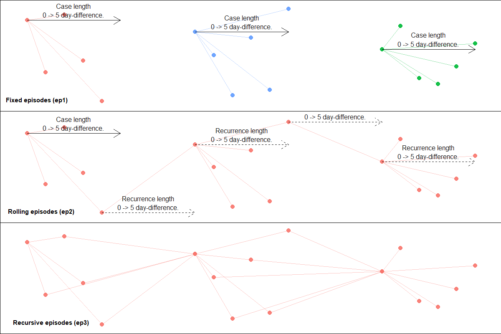
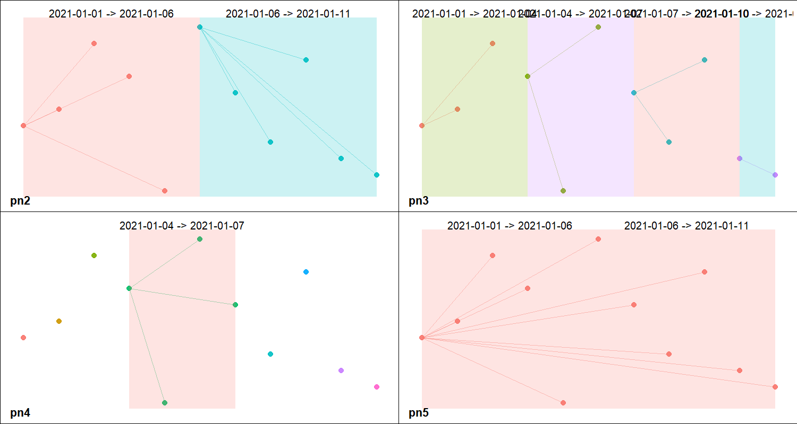

```{r setup, include = FALSE}
knitr::opts_chunk$set(
  collapse = TRUE,
  comment = "#>"
)
```

```{r include=FALSE}
# library(cowplot)
library(ggplot2)
# `schema` theme
theme <- "light" # dark vs light
bd_line <- ifelse(theme == "dark", "white", "black")
```

# Overview
`diyar` is a data analytical package for linking records with shared characteristics.
Linked records represent an entity, which depending on the context can range from unique patients or occurrences as defined by a case definition. Each entity is assigned to unique group with identifiers.
These identifiers are stored as an `S4` class with useful information about each group in their slots.

The package is capable of assessing and comparing an entity's characteristics in several ways, making it useful in ordinarily complex analyses such as record linkage and contact or network analyses, or the application of case definitions. 

The main functions are `links()` and `link_records()`, `episodes()` and `partitions()`.
These functions are very flexible in terms of what and how they compare the record's characteristics, as well as what are considered matches.
Although each is best suited to certain use cases, their functionalities can sometimes overlap.

  + `links()` and `link_record()` - compare records without a temporal aspect to them. For example, record linkage
  + `episodes()` - compare records with a temporal aspect to them, while factoring the duration between individual records. For example, contact and network analysis.  
  + `partitions()` - compare records with a temporal aspect to them, without factoring the duration between individual records. For example, application of case definitions.

<!-- It's worth noting that `links()` and `episodes()` are iterative (loops) functions.  -->
<!-- At their core, they are simply repeating comparisons of an index record against others.  -->

# Record linkage
## links
Primarily used for multi-stage record linkage.
Here, records are compared and linked based on different matching criteria over multiple stages. 
The priority of matches decreases with each stage, that is; a match at one stage (and thus criteria) is considered more relevant than a match at the next stage.
As a result, changing the order of each stage or criteria is akin to a different linkage strategy and can lead to different outcomes.
This is demonstrated below with 2-step linkages of the `missing_staff_id` sample dataset.

```{r warning = FALSE}
library(diyar)
data(missing_staff_id)
dfr_stages <- missing_staff_id[c("age", "hair_colour", "branch_office", "source_1")]
# Matching `hair_colour` before matching `branch_office`
dfr_stages$p1 <- links(as.list(dfr_stages[c("hair_colour", "branch_office")]))
# Matching `branch_office` before matching `hair_colour`
dfr_stages$p2 <- links(as.list(dfr_stages[c("branch_office", "hair_colour")]))
dfr_stages
```
Aside from an `exact_match()`, user-defined comparisons are also possible using a `sub_criteria` object.
These are `S3` objects that contains an entity's attributes and the functions to compare them.
They either relax or strengthen the match criteria. See the example below.
```{r warning = FALSE}
# A function to extract the last word in a string
last_word_wf <- function(x) tolower(gsub("^.* ", "", x))
# A logical test using `last_word_wf`.
last_word_cmp <- function(x, y) last_word_wf(x) == last_word_wf(y)
# sub_critria` objects
s_cri_a <- sub_criteria(dfr_stages$hair_colour, dfr_stages$branch_office, 
                        match_funcs = c(last_word_cmp, last_word_cmp), operator = "or")
s_cri_b <- sub_criteria(dfr_stages$hair_colour, dfr_stages$branch_office, 
                        match_funcs = c(last_word_cmp, last_word_cmp), operator = "and")

dfr_stages$p3 <- links("place_holder", sub_criteria = list("cr1" = s_cri_a), recursive = TRUE)
dfr_stages$p4 <- links("place_holder", sub_criteria = list("cr1" = s_cri_b), recursive = TRUE)
```
`sub_criteria` can be nested to achieve a nested matching criteria.
```{r warning = FALSE}
s_cri_nested_1 <- sub_criteria(s_cri_a, s_cri_b, operator = "or")
s_cri_nested_2 <- sub_criteria(dfr_stages$source_1, s_cri_b, operator = "or")
dfr_stages$p5 <- links(list("place_holder", dfr_stages$age), 
                   sub_criteria = list("cr1" = s_cri_nested_1,
                                       "cr2" = s_cri_nested_2))
```

```{r warning = FALSE}
# Results
dfr_stages
```

## link_records
Is primarily used for probabilistic record linkage.
Record-pairs are generated and compared for matches.
Matches can be weighted to allow for imperfect matches.
Match probabilities are then calculated and used to assign a match score.
```{r warning=FALSE}
dfr_5 <- missing_staff_id[c(2, 4, 5, 6)]

# Using string comparators
# For example, matching last word in `hair_colour` and `branch_office`
last_word_wf <- function(x) tolower(gsub("^.* ", "", x))
last_word_cmp <- function(x, y) last_word_wf(x) == last_word_wf(y)

p6a <- link_records(dfr_5, attr_threshold = 1,
                           cmp_func = c(exact_match, exact_match,
                                        last_word_cmp, last_word_cmp),
                           score_threshold = -4)
# Group identifiers
p6a$pid

# Weights
subset(p6a$pid_weights, record.match)
```
The required number of record-pairs doubles exponentially as the size of the dataset increases. 
This becomes memory intensive with very large datasets.
Arguments such as `blocking_attribute`, `repeats_allowed`, `permutations_allowed ` and `data_source` are used to limit the amount of record-pairs created. 

## links_wf_probabilistic
Also primarily used for probabilistic record linkage. `links_wf_probabilistic()` is a wrapper function of `links()` and an alternative to `link_records()`. It's less memory intensive but can be slower in comparison.
```{r warning=FALSE}
p6b <- links_wf_probabilistic(dfr_5, attr_threshold = 1,
                              cmp_func = c(exact_match, exact_match,
                                           last_word_cmp, last_word_cmp),
                              score_threshold = -4,
                              recursive = TRUE)
# Group identifiers
p6b$pid

# Weights
subset(p6b$pid_weights, record.match)
```
Here, a final selection is made at each iteration. Therefore, an acceptable `score_threshold` is required in advance. To help with this, `prob_score_range()` can be used to return the range of scores attainable for a given set of attributes and, `m` and `u`-probabilities. Additionally, `id_1` and `id_2` can be used to compare specific records-pairs, aiding the review of potential scores.

# Case definitions
## episodes
Primarily used for contact and network analysis.
`episodes()` is designed to compare dated records (events) and assign them to unique groups (episodes) based on the duration between events. 
Three type of episodes are possible; fixed, rolling and recursive episodes (Figure 1). 
A fixed episode is a set of events within a defined period before or after an index event. A rolling episode is a repeating series of fixed episodes linked together as recurrences. A recursive episode is a rolling episode where every event serves as an index event.

```{r warning = FALSE}
dfr_2 <- c(1:5, 10:15, 20:25)
dfr_2 <- data.frame(date = as.Date("2020-01-01") + dfr_2)
dfr_2$ep1 <- episodes(dfr_2$date, case_length = 5, episode_type = "fixed")
dfr_2$ep2 <- episodes(dfr_2$date, case_length = 5, episode_type = "rolling")
dfr_2$ep3 <- episodes(dfr_2$date, case_length = 5, episode_type = "recursive")
dfr_2
```

```{r warning=FALSE, include=FALSE}
# plt1 <- schema(dfr_2$ep1, seed = 2, show_label = c("length_arrow", "length_label"), theme = theme)
# plt2 <- schema(dfr_2$ep2, seed = 2, show_label = c("length_arrow", "length_label"), theme = theme)
# plt3 <- schema(dfr_2$ep3, seed = 2, show_label = FALSE, theme = theme)
# 
# f <- plot_grid(plt1 + theme(plot.background = element_rect(color = bd_line)), 
#                plt2 + theme(plot.background = element_rect(color = bd_line)),
#                plt3 + theme(plot.background = element_rect(color = bd_line)),
#                labels = c("Fixed episodes (ep1)", 
#                           "Rolling episodes (ep2)", 
#                           "Recursive episodes (ep3)"), 
#                label_colour = bd_line,
#                label_size = 11,
#                ncol = 1,
#                label_x = c(-.05, -.05, -.05),
#                label_y = c(.15, .15, .15))
# 
# ggsave(dpi = 100, plot = f, filename = "fig_o1.png", width = 12, height = 8, units = "in")
```

**Figure 1: Episodes.** 



There are several options to determine which records are used as the index event, how many index events are used, how many durations from the index events are assessed, the nature of recurrences where applicable and additional matching criteria through `sub_criteria` objects as described above. See `help(episodes)` for more details about these. Also useful is `episodes_wf_splits()` - a wrapper function of `episodes()` which is better optimised for analyses with duplicate records.  

## partitions
`partitions()` assigns events to groups (panes) if they are within a defined interval (Figure 2). Unlike `episodes()`, the duration between events is not a factor. Here, events from the same pane simply occurred within the same interval. See the example below.

```{r warning=FALSE}
event_dt <- seq(from = as.Date("2021-01-01"), to = as.Date("2021-01-11"), by = 1)
dfr_3 <- data.frame(date = event_dt)

# Group events into 2 equal parts per `strata`.
dfr_3$pn2 <- partitions(event_dt, length.out = 2, separate = TRUE)
# Group events into 3-day sequences per `strata`.
dfr_3$pn3 <- partitions(event_dt, by = 3, separate = TRUE)
# Group events into a specified period of time in each `strata`.
dfr_3$pn4 <- partitions(event_dt, window = number_line(event_dt[4], event_dt[7]))
# Group events from separate periods into one pane.
dfr_3$pn5 <- partitions(event_dt, length.out = 2, separate = FALSE)
```

```{r warning=FALSE, include=FALSE}
# plt1 <- schema(dfr_3$pn2, seed = 2, show_label = "window_label", theme = theme)
# plt2 <- schema(dfr_3$pn3, seed = 2, show_label = "window_label", theme = theme)
# plt3 <- schema(dfr_3$pn4, seed = 2, show_label = "window_label", theme = theme)
# plt4 <- schema(dfr_3$pn5, seed = 2, show_label = "window_label", theme = theme)
# 
# f <- plot_grid(plt1 + theme(plot.background = element_rect(color = bd_line)), 
#                plt2 + theme(plot.background = element_rect(color = bd_line)),
#                plt3 + theme(plot.background = element_rect(color = bd_line)),
#                plt4 + theme(plot.background = element_rect(color = bd_line)),
#                labels = c("pn2", "pn3", "pn4", "pn5"), 
#                label_colour = bd_line,
#                label_size = 16,
#                label_y = c(0.1,.1,0.1,0.1))
# 
# ggsave(dpi = 100, plot = f, filename = "fig_o2.png", width = 15, height = 8, units = "in")
```

**Figure 2: Panes**



# Other useful functions
There are other supporting functions which are useful for common analytical tasks.
Some of these are shown below.

## number_line
Produces a `number_line` object. 
This is an `S4` class representing two points of an interval.
It's covered in more detail in the [`number_line` and overlaps vignette](number_line.html).
It's useful when tracking episodes from periods in time as opposed to points in time.
See an example of this below.
```{r warning=FALSE}
data(hospital_admissions)
dfr_4 <- hospital_admissions[c("admin_dt", "discharge_dt")]
dfr_4$admin_period <- number_line(dfr_4$admin_dt, dfr_4$discharge_dt)
                                  
# Group overlapping hospital stays
dfr_4$nl1 <- index_window(dfr_4$admin_period)
dfr_4$ep4 <- episodes(date = dfr_4$admin_period, case_length = dfr_4$nl1)

# Group overlapping hospital stays and those within 21 days of the end point of an index hospital stay 
dfr_4$nl2 <- expand_number_line(index_window(dfr_4$admin_period), 20, "right")
dfr_4$ep5 <- episodes(date = dfr_4$admin_period, case_length =  dfr_4$nl2)
```
They can also be used as an attribute in a `sub_criteria` object.
```{r warning=FALSE}
s_cri_c <- sub_criteria(dfr_4$admin_period, match_funcs = overlaps)
dfr_4$pd5 <- links("place_holder", sub_criteria = list("cr1" = s_cri_c), recursive = TRUE)
# Results
dfr_4[c("admin_period", "nl1", "nl2", "ep4", "ep5", "pd5")]
```

## make_pairs
`make_pairs()` creates record pairs. 
```{r warning=FALSE}
prs_1 <- make_pairs(LETTERS[1:4], repeats_allowed = FALSE, permutations_allowed = FALSE)
prs_2 <- make_pairs(LETTERS[1:4], repeats_allowed = TRUE, permutations_allowed = TRUE)
prs_3 <- make_pairs(1:5000, repeats_allowed = TRUE, permutations_allowed = TRUE)

str(prs_1)
str(prs_2)
str(prs_3)
```

## combi
`combi()` creates numeric codes for unique combination of vectors.
This aims to be a faster alternative to `paste0` when it's more relevant to know a unique combination instead of the exact combination.
```{r warning=FALSE}
cmbi_dfr <- dfr_stages[c(1, 2)]
cmbi_dfr$combi_nm <- paste(cmbi_dfr[[1]], cmbi_dfr[[2]])
cmbi_dfr$combi_cd <- combi(as.list(cmbi_dfr))
cmbi_dfr
```


# Processing time
`episodes()` and `links()` are iterative functions.
Although both continue to be optimised, each iteration costs additional processing time.
The main way to mitigate this is to reduce the number of iterations required to complete an analysis. 
To help with this, both functions have arguments which ensure that only the minimum number of records required to complete the process is used.

The flexibility of `episodes()` and `links()` results in situations where the use of different arguments will lead to the same outcome. However, one combination will usually require fewer iterations to complete the same process. 
Therefore, a good grasp of the role of each argument is useful in knowing the most efficient combination of arguments to use. 

In some analyses, `episodes()` and `links()` can be used interchangeably however, one is usually less efficient in each situation.
For example, identifiers `dfr_4$ep4` and `dfr_4$pd5` are essentially the same outcome; 2 groups with the same set of records in each. However, we can see below that `episodes()` created `dfr_4$ep4` in 2 iterations compared to the 7 iterations it took `links()` to create `dfr_4$ep4`.
```{r warning=FALSE}
summary(dfr_4$ep4)

summary(dfr_4$pd5)
```
It's also worth noting that using a `sub_criteria` can cost a lot in processing time.
Therefore, it should not be used if it can be avoided.
For example, `dfr_stages$p4` was created using `sub_cri_b` which took `r max(dfr_stages$p4@iteration)` iterations.
However, the same outcome can be achieved in 1 iteration with a `criteria`. 
See the difference below.
```{r warning=FALSE}
dfr_stages$p4b <- links(criteria = combi(last_word_wf(dfr_stages$hair_colour),
                                         last_word_wf(dfr_stages$branch_office)))

summary(dfr_stages$p4b)

all(dfr_stages$p4 == dfr_stages$p4b)
```

The time differences from these different iterations are negligible when dealing with relatively small datasets but become more apparent as the size increases.
